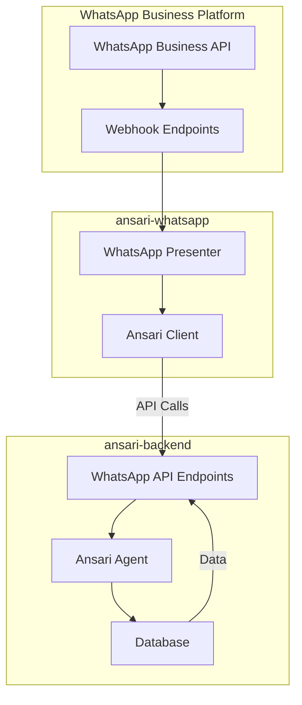
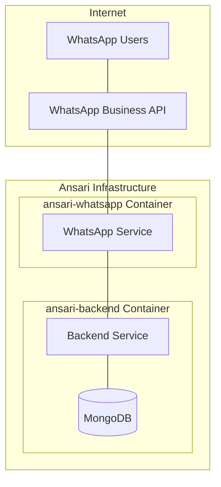
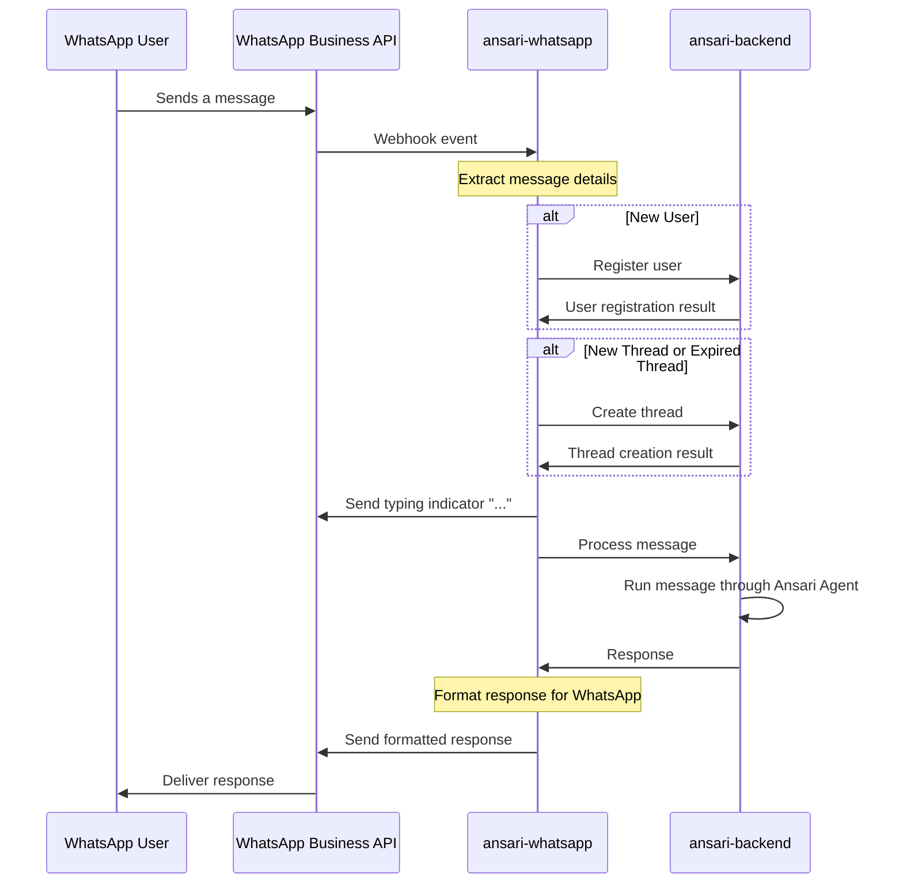
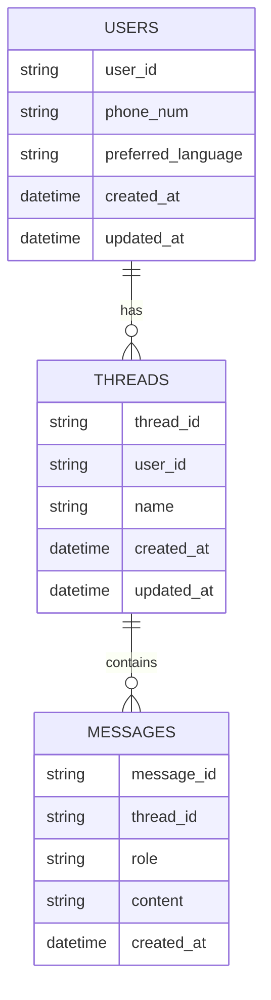

***TOC:***

- [Ansari WhatsApp Architecture Overview](#ansari-whatsapp-architecture-overview)
  - [System Architecture](#system-architecture)
  - [Deployment Architecture](#deployment-architecture)
  - [Component Overview](#component-overview)
    - [ansari-whatsapp](#ansari-whatsapp)
    - [ansari-backend](#ansari-backend)
  - [Message Flow](#message-flow)
  - [API Endpoints](#api-endpoints)
    - [ansari-whatsapp Endpoints](#ansari-whatsapp-endpoints)
    - [ansari-backend WhatsApp API Endpoints](#ansari-backend-whatsapp-api-endpoints)
  - [Data Model](#data-model)
  - [Future Improvements](#future-improvements)

# Ansari WhatsApp Architecture Overview

This document provides a high-level design overview of the Ansari WhatsApp service and its interaction with the main Ansari backend.

## System Architecture

The Ansari ecosystem has been divided into two main components:

1. **ansari-backend**: The core service that contains the LLM (Large Language Model) integration, business logic, and database operations
2. **ansari-whatsapp**: A dedicated service for handling WhatsApp communication that acts as a client to the ansari-backend

This separation provides several benefits:
- Improved maintainability by isolating WhatsApp-specific logic
- Better scalability as each service can be scaled independently
- Cleaner codebase with clear separation of concerns
- Simplified deployment and updates

## Deployment Architecture

The two services are deployed independently but work together as shown in the following diagram:

## Component Overview

### ansari-whatsapp

The WhatsApp service is built as a FastAPI application with the following key components:

- **app/main.py**: Entry point for the FastAPI application that handles webhook events from the WhatsApp Business API
- **presenters/whatsapp_presenter.py**: Core component that processes incoming messages, determines appropriate actions, and formats responses
- **utils/ansari_client.py**: Client library that communicates with the ansari-backend API endpoints
- **utils/config.py**: Configuration management using Pydantic and environment variables
- **utils/language_utils.py**: Utilities for language detection and text direction determination
- **utils/whatsapp_logger.py**: Enhanced logging functionality for the service

### ansari-backend

The backend service exposes dedicated API endpoints for the WhatsApp service:

- **whatsapp_router.py**: Provides endpoints specifically for WhatsApp service integration
- **Database Integration**: Handles storage and retrieval of WhatsApp messages, threads, and user data
- **Ansari Agent**: Processes messages using LLM and generates responses

## Message Flow

The following diagram illustrates the flow of a user message from WhatsApp to the backend and back:

## API Endpoints

### ansari-whatsapp Endpoints

- **GET /whatsapp/v2**: WhatsApp webhook verification endpoint
- **POST /whatsapp/v2**: Main webhook endpoint for receiving WhatsApp messages

### ansari-backend WhatsApp API Endpoints

- **POST /whatsapp/v2/users/register**: Register a new WhatsApp user
- **GET /whatsapp/v2/users/exists**: Check if a WhatsApp user exists
- **PUT /whatsapp/v2/users/location**: Update a user's location
- **POST /whatsapp/v2/threads**: Create a new message thread
- **GET /whatsapp/v2/threads/last**: Get information about the last active thread
- **GET /whatsapp/v2/threads/{thread_id}/history**: Get thread message history
- **POST /whatsapp/v2/messages/process**: Process a message and generate a response

## Data Model

## Future Improvements

Potential enhancements to the architecture include:

1. **Message Queue**: Implementing a message queue between the services for better reliability
2. **Caching (If Applicable/Useful)**: Adding a caching layer to reduce load on the backend
3. **Multi-instance Support (If Useful)**: Enhancing the architecture to support multiple WhatsApp service instances
4. **Monitoring & Metrics (If Useful)**: Adding comprehensive monitoring and metrics collection